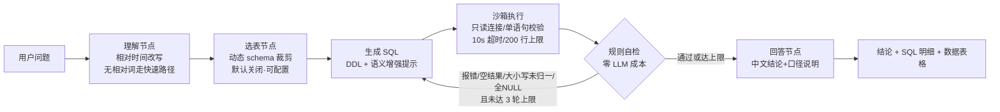

# nl2sql-agent · 数据问答分析 Agent

基于 LangGraph 的 Text-to-SQL 数据分析 Agent：用户用自然语言提问，Agent 分析表结构、生成 SQL、在只读沙箱中执行、**结果异常时带反馈自动回炉重写**，最终返回数据表格与中文结论。配套 **120 题自建评测集**与量化回归报告。

## 解决的问题

业务人员不会写 SQL，数据分析师被重复取数淹没；市面上的 NL2SQL 工具（DB-GPT、Vanna 等）重产品、缺**可执行的反馈闭环**与**可复现的评测体系**。本项目自建两者：

1. **执行反馈自纠错闭环**——SQL 报错或结果可疑时，携带报错/自检反馈回到生成节点重写（上限 3 轮）；
2. **评测驱动迭代**——每个优化都有 120 题回归数据支撑，失败按归因分类处理。

## 架构



- **自纠错循环**（`src/agent/nodes/check.py` + LangGraph 条件边）：check 节点不耗 LLM，检测执行报错、空结果、文本列大小写不一致、全 NULL 列；
- **安全基线**（`src/db/engine.py`）：SQLite 只读模式、仅放行单条 SELECT/WITH、progress-handler 实现查询超时、行数上限；
- **LLM 统一调用层**（`src/llm/client.py`）：GLM / DeepSeek / 通义 / OpenAI 注册表（OpenAI 兼容协议），切服务商只改环境变量，重试退避与 Token 统计集中一处。

## 评测驱动的优化数据

自建 120 题分层评测集（easy 60 / medium 40 / hard 20，gold SQL 逐题实库验证），模型 deepseek-chat：

| 配置 | 执行准确率 | easy / medium / hard | 平均 Token/题 |
|---|---|---|---|
| 基线（全量 DDL，无提示） | 78.3% | 86.7 / 82.5 / 45.0 | 1420 |
| **+schema 语义增强（当前配置）** | **87.5%** | 100 / 87.5 / 50.0 | 1773 |
| +动态 schema 裁剪（已验证、默认关闭） | 83.3% | 98.3 / 85.0 / 35.0 | 1532 |

两个用数据换来的工程结论：

- **提示词注入的领域知识必须纯描述**。第一版提示含"存在异常值"等建议性措辞，诱导模型自行清洗数据、改变统计口径，准确率反而跌到 75.0%；改为纯描述后 87.5%。
- **动态裁剪在小 schema 上负收益**。选表调用的 Token 开销 ≈ DDL 节省量，且漏选伤准确率（-4.2pt）；实现保留为开关，大 schema 场景再启用。

评测方法与全部回归报告见 [`evals/`](evals/)（JSON 汇总 + CSV 逐题明细，报告内嵌 git commit 号）。

## 快速开始

```bash
# 1. 环境（Python 3.11）
py -3.11 -m venv .venv
.venv\Scripts\activate

# 2. 安装
pip install -r requirements.txt

# 3. 配置（填入任意一家服务商的 Key）
copy .env.example .env

# 4. 生成业务演示库（14 张表，含日期格式混杂/状态大小写/金额异常等真实脏数据）
python data/generator.py

# 5. 启动
streamlit run src/ui/app.py
```

## 技术栈

LangGraph（状态机/条件边自纠错）· OpenAI 兼容多模型协议 · SQLite（只读沙箱）· Streamlit · Langfuse（调用追踪）· pytest（45 个单元测试）· ruff + pre-commit

## 未来迭代

- 评测集扩充至 200 题并引入公开数据集（Spider/BIRD）子集做横向对比
- few-shot 示例检索：按问题相似度动态挑选示例，替代静态提示
- 图表自动生成（Plotly）与多轮追问（上下文内改查询）
- 模型微调：用评测失败 case 构造训练数据，对比 small model 微调效果

## License

MIT
